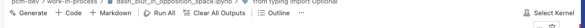

# PCM 101 env setup

## TL:DR;

Open VSCode, open a Terminal within it, and

```bash
git lfs install
git clone https://github.com/jgoldstone/pcm-hdm-202603.git
cd pcm-hdm-202603
uv sync
uv run python -c "import numpy, colour, plotly; print('Environment OK')"
```

Using the VSCode command palette (cmd-sh-P on macOS, ctrl-sh-P on Windows):
```bash
Select Python Interpreter
```
and choose the interpreter located in `.venv`

Before using a Jupyter notebook for the first time, in the top-right of the notebook window, click Select Kernel, and choose the interpreter inside `.venv`.



You also need to read the ["Before each session starts"](#before-each-session-starts) section below (near the very end).

## The longer intro

Part of achieving the reproducibility required for production-grade color management is cleanly separating tool choice, tool configuration and environment setup.

- Tool choice is usually done at the facility level ("We're a Nuke shop.");
- Tool configuration is usually done on a per-show basis ("These are the plugins already installed in your Docker image"); and
- Which particular third-party packages are used for your work will be decided on a show-wide or shot-specific basis.

We will treat the courseroom as if it were a studio; the shared learning task can be considered a show; and your group projects can be considered scenes that you may yourselves break up into shots.

The studio-wide tooling choices are to use Visual Studio Code as a common learning environment, Python as the programming language in which ideas will be made concrete, and GitHub-flavored Markdown as the way in which your projects will be sketched, documented and presented.

[uv-homepage]: https://github.com/astral-sh/uv
[astral-homepage]: https://astral.sh
The show-specific configurations are to use [`uv`][uv-homepage], a fast, open-source, Rust-based Python package manager from [Astral][astral-homepage], to use the Jupyter and Jupyter-aware plotting extensions for common tooling, and the **markdownlint**, **Markdown All in One**, and **Markdown Preview GitHub Styling** extensions for writing documentation.

The show-wide choices of package are partially made for you: Colour-Science to save you drudgework and eliminate distractions of low-level coding, and OpenColorIO for efficient application of color management operators.

## Global setup

We assume `git` and Git LFS, `uv`, and the VSCode appliication are already installed, and that you have access to the Internet to download VSCode extensions and Python packages. What follows will help you verify this is true.

#### Visual Studio Code

The Visual Studio Code application should already be installed. Launch it. Two extensions are critical:

- Python
- Jupyter

Check: in VSCode, Code > Settings... > Extensions, and you should see all of these (each should have a blue badge with a checkmark, and 'Microsoft' underneath):

- Python
- Pylance
- Python Environments
- Python Debugger
- Jupyter
- Jupyter Keymap
- Jupyter Slide Show
- Jupyter Cell Tags
- Jupyter Notebook Renderers
  
Optional, but very handy extension:

- vscode-pdf (so you can look at PDFs without leaving VSCode)

When we say 'open a Terminal window' below, we always mean a terminal window inside the VS COde application. 

Within VSCode, open a new Terminal window.

- macOS: Terminal > New Terminal
- Windows: Terminal -> New Terminal (PowerShell)
- linux: ?

#### `git`

Python notebooks for the upcoming session, images and data and other resources those notebooks might require, and PDFs of presentations from previous lessons will be distributed via `git`, which should already be installed on your system. Storing large images in a version control system originally designed to handle source codce is clumsy, so we will use [Git LFS](https://git-lfs.com) (Git Large File Storage) to hold the images separately ... but transparently. Git LFS works behind the scenes whenever you check in or check out OpeEXR (.exr suffix) or TIFF (.tif or .tiff suffix) files.

If you don't have `git` already installed, the best way to install it (and Git LFS) is with a package manager. The complete details of how to use a package manager would be longer than this README; find the one appropriate for your platform and use it to install git, or have someone (e.g. an administrator) do this for you.

Check for `git`:

```bash
git --version
```

This should produce something like:
```bash
git version 2.53.0
```

Check for Git LFS:

```bash
git lfs version
```

This should produce something like:
```bash
git-lfs/3.7.1 (GitHub; darwin arm64; go 1.25.2)
```

(The fine details might be different, 'darwin arm64' being macOS-specific. You get the idea.)

#### `uv`

For package management, as mentioned above, this course uses `uv`. Below we test to make sure it is installed:

Check:
```bash
uv --version
```

This should produce something like:

```bash
uv 0.9.11 (8d8aabb88 2025-11-20)
```

If instead you get some message indicating `uv` isn't installed on your system, you'll need to install it, or have someone install it for you. Installation instructions can be found in the `uv` documentation, mentioned above and re-linked [here][uv-homepage].

#### `python`

The Python used in this course employs type hints as much as possible, so that the VSCode IDE and embedded tools like Pylance can detect a wide variety of errors before runtime. These type hints may rely on constructs that were introduced in Python 3.12 (released). That Python release should be stable until fall 2028.

FOr this course you will use a version of Python in a virtual environment, which `uv` will set up for you.


#### Putting the pieces together

You should be in your project directory. Check this with `ls`:

```bash
ls
```

The output of this command should include files such as `pyproject.toml', `uv.lock`, `README.md`, etc.

Now install Python and the packages we want from distribution sites like [pypi.org](https://pypi.org/) with the single command:
```bash
uv sync
```

## Before each session starts

Before session *N*, you'll pull down new files from the class repo. This is a simple `git pull`:

```bash
git pull
```

Then **immediately** copy the new notebooks from `notebooks/distributed` to `notebooks/student-work`. This ensures that when you next do a `git pull`, `git` won't complain about you having made changes to a file it distributed, if between this session and the next one, a new copy of a notebook from a prior session is released.

The naming conventions for notebooks are designed to help keep things straight. For the second session of the third day, the notebook names with start with `03-02-`, as in, `03-02-using_ocio_on_apple_log.ipynb`.

```bash
cp notebooks/distributed/03-02-* notebooks/student-work
```

## Validation

At this point it's a good idea to make sure all the pieces are fitting together. We can use Colour-Science to do some graphing...

File > New File…, then choose Python Notebook. This will create a file with a name like "Untitled-1.ipynb". You will see a Python notebook cell, that looks something like this:

[figure here]

In the cell, enter

```python
from colour.plotting import *

colour_style()
```

and then press Shift + Enter to tell Jupyter to evaluate the cell. This will set up your environment by pre-calculating a large number of things. This can take a while; on a modern laptop (M4 Max) initialization took slightly less than 30 seconds. It's a one-time cost; other interactions take place at a good speed.

When the `colour_style()` initialization finishes, you'll see aother Jupyter cell. This time, invoke some graphics code (which is based on `matplotlib`, which at least initially was a port of basic MATLAB plotting capabilities):

```python
plot_visible_spectrum("CIE 1931 2 Degree Standard Observer")
```
